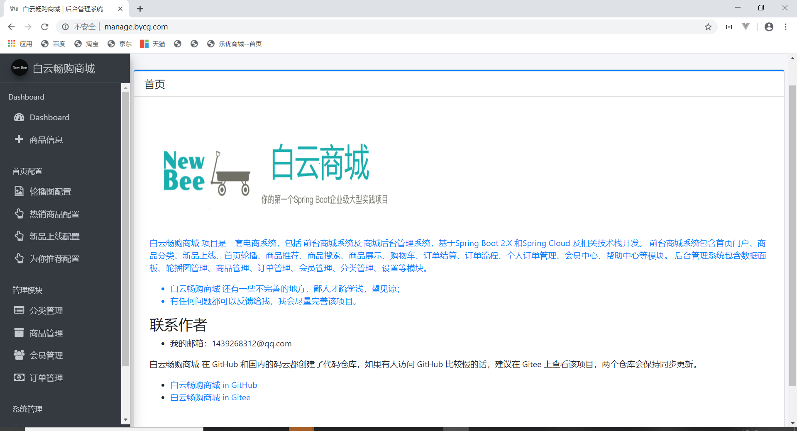
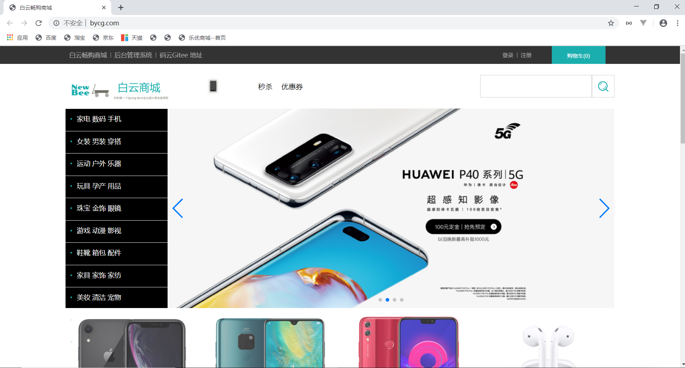

# leyou-shop

# 白云畅购商城

## 1项目介绍

- 白云畅购商城是一个全品类的电商购物网站（B2C）。
- 用户可以在线购买商品、加入购物车、下单
- 管理员可以在后台管理商品的上下架、促销活动
- (待完善)
- 可以评论已购买商品
- 管理员可以监控商品销售状况
- 客服可以在后台处理退款操作

## 2系统架构

### 2.1.系统架构

整个白云畅购商城是一套电商系统可以分为两部分：后台管理系统、前台门户系统。

基于 Spring Boot 及相关技术栈开发。前台商城系统包含首页门户、商品分类、新品上线、首页轮播、商品推荐、商品搜索、商品展示、购物车、订单结算、订单流程、个人订单管理、会员中心、帮助中心等模块。后台管理系统包含数据面板、轮播图管理、商品管理、订单管理、会员管理、分类管理、设置等模块。
  - 后端首页：
    

- 前台门户

   

无论是前台还是后台系统，都共享相同的微服务集群，包括：

- 商品微服务：商品及商品分类、品牌、库存等的服务
- 搜索微服务：实现搜索功能
- 订单微服务：实现订单相关（待实现）
- 购物车微服务：实现购物车相关功能
- 用户中心：用户的登录注册等功能
- Eureka注册中心
- Zuul网关服务

# 2.技术选型

## 2.1.相关技术

前端技术：

- 基础的HTML、CSS、JavaScript 
- JQuery 
- Bootstrap
- jQueryUI
- kindeditor-4.1.10
- ......

后端技术：

- 基础的SpringMVC、Spring 5.x和MyBatis3
- Spring Boot  **2.2.5.RELEASE** 
- Spring Cloud 最新版  **Hoxton.SR3** 
- nginx-1.14.2
- FastDFS - 1.26.6-RELEASE
- Thymeleaf
- mysql   8.0.17

## 2.2.技术解读

以上技术组合在项目中解决以下电商中的问题：

- 利用SpringCloud技术栈，实现真正的微服务实战开发，并且是基于SpringBoot2.2.5和SpringCloud最新版本Hoxton.SR3实现，业内领先。

- 基于FastDFS解决大数据量的分布式文件存储问题

- 基于LocalStorage实现离线客户端购物车，减轻服务端压力。

- 基于Thymeleaf实现页面模板和静态化，提高页面响应速度和并发能力

- 基于Nginx实现初步的请求负载均衡和请求限流

## 2.2.开发环境

- IDE：IntelliJ IDEA 2019.1.3 x64 版本
- JDK： JDK1.8
- 项目构建：maven3.6.0
- 版本控制工具：git

## 2.3.域名

在开发的过程中，为了保证以后的生产、测试环境统一。都采用域名来访问项目。

一级域名：www.bycg.com

二级域名：manage.bycg.com , api.bycg.com

## 2.5更多项目截图 :  https://gitee.com/jingzila/leyou-shop/tree/master/leyou-project-Images 

